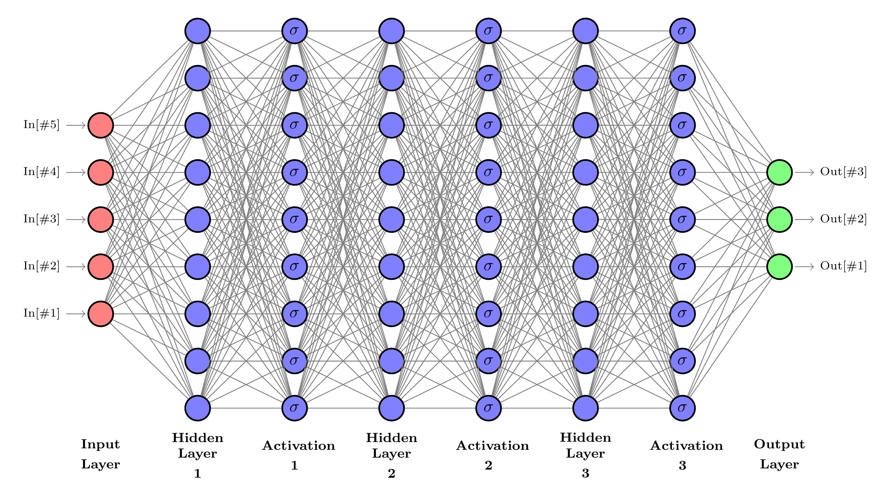

# MultivariateAnalysis

    

## Authors

* [**Rocco Ardino**](https://github.com/RoccoA97) (University of Padua)
* [**Alessandro Valente**](https://github.com/mastrovalentz) (University of Padua)

## Abstract
The b-Baryon decay into the c-Baryon plus three pions has never been observed, however it is a fundamental ingredient for the studies of lepton universality in semileptonic b-Baryon decays. Using a sample of LHCb data prepared with observables useful for discriminating signal from background events, we perform a signal selection separating interesting events from background using multivariate analysis techniques, including Deep Neural Networks. After having selected the best figure-of-merit able to successfully solve the problem, a detailed study of the effect on the multivariate analysis due to different fractions of the total sample used for training the network is done (minimizing the overtraining when present). The performances of the sample selection will are then studied as a function of the different hyperparameters of the DNN, including for example:
* batch size and number of epochs;
* number of neurons per layer;
* dropout rate per layer;
* activation functions;
* loss function;
* optimizer;
* regularizer.

After having tuned almost every hyperparameter of the network, we tested its performances on both the complete and a reduced one background dataset.

## Content of the folder
The repository is organized as follows:
* **`code`**: all the R source code written for the study;
* **`references`**: some references useful to understand the fundamentals of this study;
* **`Tuner_Results`**: the results from tuning of every hyperparameter;
* **`Models`**: files containing the parameters for every model tested in the tuning;
* **`presentation`**: folder containing a notebook for the final presentation in both html and ipynb notebook formats.

In particular, the final presentation can be found [**here**](https://github.com/RoccoA97/MultivariateAnalysis/blob/main/presentation/presentation.ipynb), in ipynb notebook format, and [**here**](https://github.com/RoccoA97/MultivariateAnalysis/blob/main/presentation/presentation.html), in html format.
